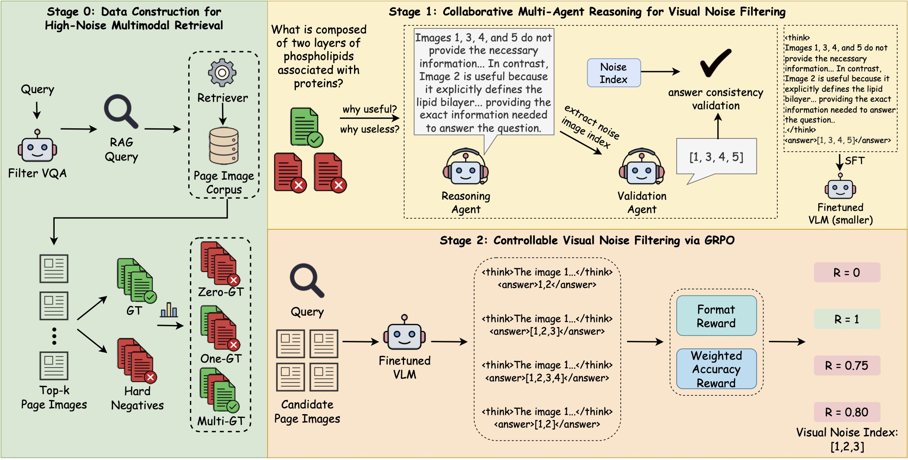
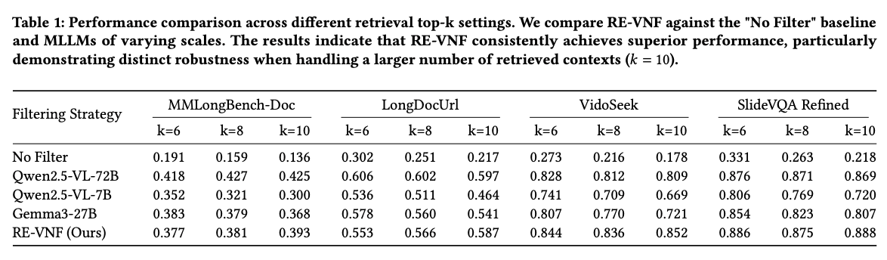
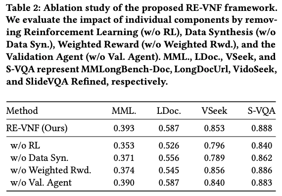
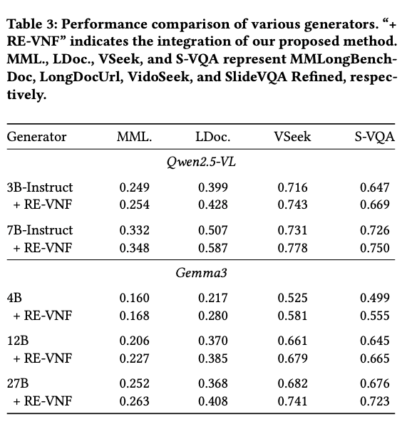
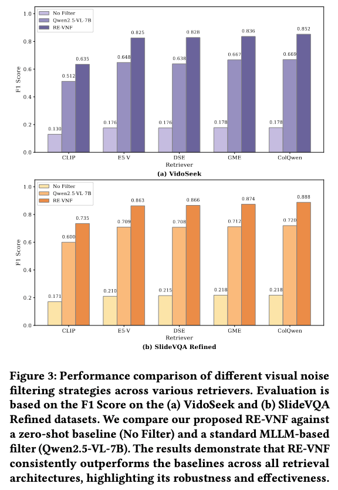
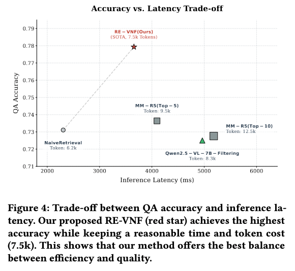

# RE-VNF: Reasoning-Enhanced Visual Noise Filtering in Multimodal RAG

****

## 📖 Table of Contents

- [📖 Table of Contents](#-table-of-contents)
- [📑 Introduction](#-introduction)
- [📈 Results](#-results)
- [🚀 Getting Started](#-getting-started)
- [❤️ Acknowledgements](#️-acknowledgements)


## 📑 Introduction

We introduce RE-VNF, a novel framework designed to enhance multimodal reasoning in RAG systems. Unlike normal RAG pipelines that blindly accept all retrieved images, RE-VNF actively identifies and filters out visual noise before the final answer generation to improve factual accuracy. To build a strong foundation, we first construct a balanced, high-noise training dataset through hard negative mining. Furthermore, RE-VNF employs a collaborative multi-agent framework, using two specialized models to write and check structured, step-by-step reasoning paths for noise filtering. Finally, we optimize the target model through SFT and GRPO, leveraging a weighted reward to ensure the filtering process is highly accurate and protects useful facts.


## 📈 Results

Table 1 evaluates our proposed Reasoning-based Visual Noise Filtering (RE-VNF) method against a "No Filter" baseline and various MLLMs under different retrieval top-k settings. The results demonstrate that RE-VNF consistently achieves superior performance across multiple benchmarks, including MMLongBench-Doc and VidoSeek. Notably, while standard models suffer from noticeable performance degradation as the context window expands, our approach exhibits distinct robustness, effectively mitigating visual noise and maintaining high accuracy even when handling a larger number of retrieved contexts (k=10).











## 🚀 Getting Started

You can download the datasets from the following links:
- [ViDoSeek & SlideVQA Refined](https://huggingface.co/datasets/autumncc/ViDoSeek)
- [MMLongBench-Doc](https://github.com/mayubo2333/MMLongBench-Doc)
- [LongDocUrl](https://huggingface.co/datasets/dengchao/LongDocURL)

You can download the filter model from [here](https://huggingface.co/ACMMM-2026-submission-RE-VNF/my-model)

```python
from evaluate.filter.noiser_vllm import QueryNoiser

filter = QueryNoiser('model_path')

# vidoseek Test data gt_page: 03c7d62afbcc088cad1c810c09a71df29a29c968_4.jpg
query = "Apply for Nordic Swan Ecolabel license, what is recommended as a web browser according to the Nordic Ecolabelling Portal instructions?"
image_list = [
    "data/03c7d62afbcc088cad1c810c09a71df29a29c968_6.jpg",
    "data/03c7d62afbcc088cad1c810c09a71df29a29c968_5.jpg",
    "data/03c7d62afbcc088cad1c810c09a71df29a29c968_1.jpg",
    "data/03c7d62afbcc088cad1c810c09a71df29a29c968_8.jpg",
    "data/03c7d62afbcc088cad1c810c09a71df29a29c968_4.jpg"
]

think_content, predicted_order = filter.find_noise(query, image_list)

print(f"Query: {query}")
print(f"noise index: {predicted_order}")
print(f"relevant index: {[i for i in range(len(image_list)) if i not in predicted_order]}")
```

## ❤️ Acknowledgements

This project benefits from the following open-source projects:

- [SWIFT](https://github.com/modelscope/ms-swift)
- [Easy-R1](https://github.com/hiyouga/EasyR1)

