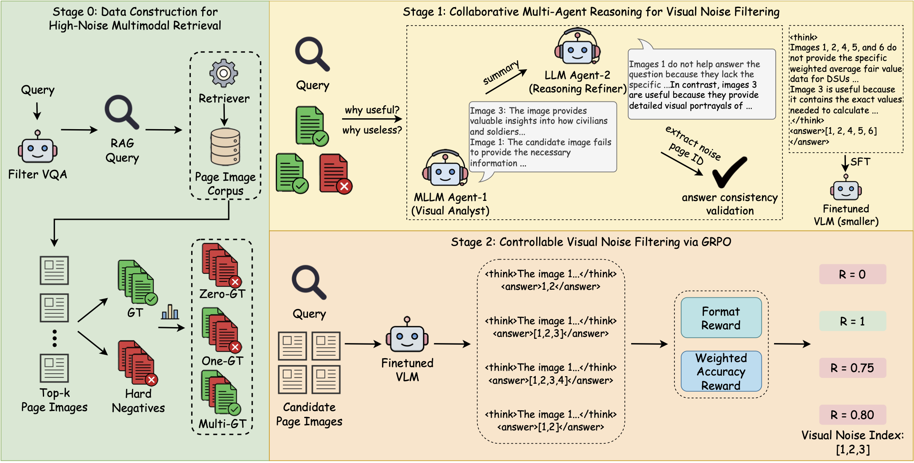
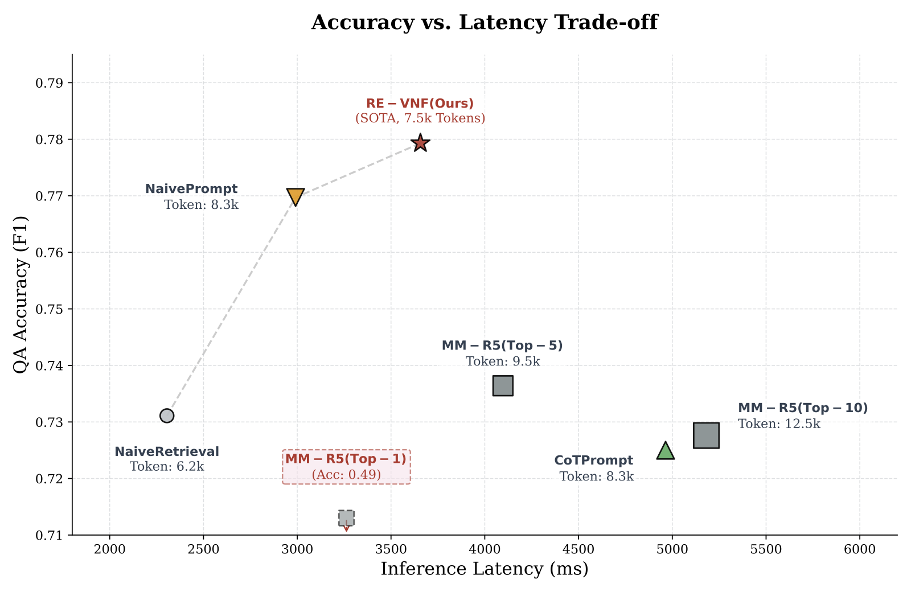

# Re-VNF: Reasoning-Enhanced Visual Noise Filtering in Multimodal RAG

****

## 📖 Table of Contents

- [📖 Table of Contents](#-table-of-contents)
- [📑 Introduction](#-introduction)
- [📈 Results](#-results)
- [🚀 Getting Started](#-getting-started)
- [❤️ Acknowledgements](#️-acknowledgements)


## 📑 Introduction

We introduce RE-VNF, a novel Reasoning-Enhanced Visual Noise Filtering framework designed to mitigate hallucinations and enhance robustness in Multimodal Retrieval-Augmented Generation (RAG) systems. Unlike existing multimodal reranking approaches that merely reorder candidates but inevitably retain noise due to unpredictable cutoff thresholds, RE-VNF empowers the generator to explicitly identify and discard irrelevant visual content through an end-to-end reasoning mechanism. The framework follows a two-stage training paradigm: during the supervised fine-tuning (SFT) stage, we employ a Collaborative Multi-Agent Reasoning mechanism to distill expert-level discrimination capabilities into the model, utilizing contrastive analysis between hard negatives and ground truths to generate high-quality reasoning traces. In the second stage, Group Relative Policy Optimization (GRPO) is applied to further align the model with a controllable filtering paradigm using a weighted accuracy reward, specifically designed to maximize filtering precision without compromising the recall of critical visual evidence. This integration of reasoning distillation and reward-driven optimization allows RE-VNF to effectively balance information preservation and noise reduction. Experiments on the ViDoSeek and SlideVQA Refined benchmarks demonstrate that RE-VNF achieves state-of-the-art performance, enabling a significantly smaller 7B model to surpass much larger baselines in handling noisy visual contexts.


## 📈 Results

Our method, RE-VNF, consistently achieves state-of-the-art performance across distinct evaluation benchmarks, including both noise filtering efficiency and downstream generation quality. Compared with robust VLM prompting and reranking baselines, RE-VNF brings significant improvements; for instance, compared with the strong Qwen2.5-VL-7B-Instruct baseline using CoT prompting, F1@5 on ViDoSeek improves from 0.6691 to 0.8373 , and even surpasses the significantly larger Qwen2.5-VL-72B model by 2.61 points , demonstrating the effectiveness of our two-stage training framework in explicitly identifying and discarding irrelevant visual contexts.


Inference efficiency analysis. Re-VNF (red star) achieves SOTA accuracy with optimized token usage (7.5k), demonstrating a superior trade-off compared to computation-intensive baselines like MM-R5 and CoT Prompting.


## 🚀 Getting Started

You can download the datasets from [here](https://huggingface.co/datasets/autumncc/ViDoSeek)

You can download the filter model from [here](https://huggingface.co/ACL-2026-submission-Re-VNF/my-model)

```python
from evaluate.filter.noiser_vllm import QueryNoiser

filter = QueryNoiser('model_path')

# vidoseek Test data gt_page: 03c7d62afbcc088cad1c810c09a71df29a29c968_4.jpg
query = "Apply for Nordic Swan Ecolabel license, what is recommended as a web browser according to the Nordic Ecolabelling Portal instructions?"
image_list = [
    "data/03c7d62afbcc088cad1c810c09a71df29a29c968_6.jpg",
    "data/03c7d62afbcc088cad1c810c09a71df29a29c968_5.jpg",
    "data/03c7d62afbcc088cad1c810c09a71df29a29c968_1.jpg",
    "data/03c7d62afbcc088cad1c810c09a71df29a29c968_8.jpg",
    "data/03c7d62afbcc088cad1c810c09a71df29a29c968_4.jpg"
]

think_content, predicted_order = filter.find_noise(query, image_list)

print(f"Query: {query}")
print(f"noise index: {predicted_order}")
print(f"relevant index: {[i for i in range(len(image_list)) if i not in predicted_order]}")
```

## ❤️ Acknowledgements

This project benefits from the following open-source projects:

- [SWIFT](https://github.com/modelscope/ms-swift)
- [Easy-R1](https://github.com/hiyouga/EasyR1)

